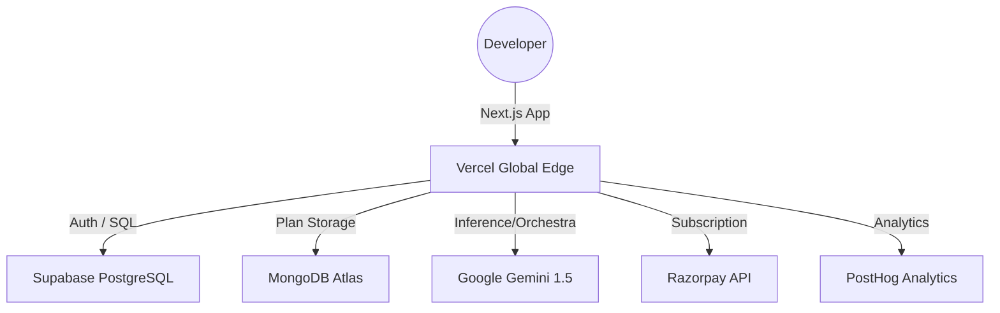

# PromptMint Architecture & System Design

## Overview
**PromptMint** is an industrial-grade engineering orchestrator designed to bridge the gap between human intent and AI execution. It transforms vague development ideas into structured, tech-stack-aware **CO-STAR** prompts and multi-phase **Agentic Flight Plans**.

## The Problem
Standard LLMs often "hallucinate" or produce generic boilerplate when given underspecified prompts (e.g., "build a login page"). This leads to:
- **Style Churn**: Constant re-prompting to fix styling or framework choices.
- **Architectural Drift**: AI making decisions that conflict with your existing codebase.
- **Wasted Velocity**: Developers spend more time "arguing" with AI than shipping features.

## Product Tiers

### 🆓 Free Tier
- **Orchestration**: Full access to the CO-STAR engine and stack inference.
- **Limits**: 5 prompts per month (tracked by IP for guests, account for signed-in users).
- **Storage**: Local session storage only.

### 💎 Pro Tier (₹149/month)
- **Unlimited Velocity**: No monthly prompt limits.
- **Cloud Sync**: Global prompt history synced across devices via Supabase.
- **Advanced Orchestration**: Access to interactive Agentic Dashboards.
- **Priority Support**: Direct engineering support channel.

## Feature Ecosystem

### 🧠 AI Orchestration Engine
- **CO-STAR Framework Enforcement**: Automatically restructures messy ideas into a 6-part prompt architecture (**Context, Objective, Style, Tone, Audience, Response**).
- **Engineering Goal Modes**: 9 distinct modes to tailor output:
    - `Scaffold`: Rapid boilerplate with TODOs.
    - `Production-ready`: Hardened, tested, type-safe logic.
    - `Refactor`: Clean up legacy code and technical debt.
    - `Debug`: Root-cause analysis and regression testing.
    - `Performance`: Latency and resource optimization.
    - `a11y/SEO`: Compliance-driven generation.
    - `Agentic Flight Plan`: Multi-phase roadmap.
- **20+ Target Personas**: Optimized instructions for AI models (GPT-4, Claude 3.5) and AI-First IDEs (**Cursor, Windsurf, Trae, v0**).
- **Smart Tech Stack Inference**: Proprietary logic that "guesses" the best technologies for your idea with 90% accuracy.
- **Literal Stack Enforcement**: Verbatim guardrails that prevent AI from suggesting conflicting or extraneous libraries.
- **Real-time Conflict Detection**: Visual alerts when requested tech (e.g., "SQL") contradicts the selected stack (e.g., "MongoDB").
- **Adaptive Verbosity**: Dynamically scales the prompt length from "Punchy & Direct" (simple tasks) to "Deeply Contextual" (complex features).

### 🛠️ Developer UI/UX features
- **Agentic Dashboard**: An interactive, multi-phase interface that turns AI plans into a manageable project checklist.
- **Prompt Health Monitor**: Real-time feedback on prompt detail, technical consistency, and structural integrity.
- **Code Context Dropper**: A dedicated field for pasting manifest files (`package.json`, `schema.prisma`) to ground the AI in your existing codebase.
- **Stack Presets**: Quick-start templates for modern development (T3 Stack, MERN, Supabase SaaS, Mobile).
- **Architecture Guardrails**: 15+ selectable engineering standards (e.g., "Strict TypeScript", "Zod Validation", "Responsive First").
- **Industrial Design System**: High-contrast typography, premium blur effects, and smooth Framer Motion transitions tailored for architects.
- **Multimodal Testing**: One-click buttons to launch and test prompts directly in Claude, GPT, Perplexity, or Grok.

### 💼 Product & Productivity
- **Prompt Recipes (Pro)**: Save and name custom configurations for recurring architectural tasks.
- **Export Suite**:
    - **Microsoft Word (.doc)**: Professional reports for stakeholders.
    - **Markdown (.md)**: Clean documentation for git repositories.
- **Cloud Sync (Pro)**: Persistent history across devices via Supabase.
- **Local History (Free)**: Quick access to recent work via secure local storage.
- **Token Estimation**: Heuristic analysis of AI payload for cost and context window management.
- **Universal Share**: Web Share API integration for mobile and desktop collaboration.

## Technical Stack & Infrastructure

### Frontend & Visuals
- **Next.js 14**: Utilizing App Router for high-performance server-side rendering.
- **Tailwind CSS**: Utility-first styling with custom "Industrial" color palette (Cyan/Emerald/Violet).
- **Framer Motion**: Micro-interactions, skeleton loaders, and physics-based transitions.
- **Lucide React**: Modern iconography for engineering tools.

### Backend & Storage
- **Supabase (PostgreSQL)**: Manages secure user authentication, architectural profiles, and subscription state.
- **MongoDB Atlas**: High-frequency storage for deep, nested agentic plans and prompt history.
- **Google Gemini API**: Industrial-grade reasoning for stack inference and prompt transformation.
- **Pollinations.ai**: Lightning-fast image and conceptual visualization engine.

### Payments & Operations
- **Razorpay**: Integrated subscription engine with support for recurring INR billing and secure checkouts.
- **PostHog**: Advanced event tracking for feature usage analysis and performance monitoring.
- **Vercel**: Edge-first deployment with automatic global distribution and preview environments.

## Infrastructure Architecture

## Future Roadmap (Planned)
- [ ] **Multi-file generation**: Direct integration with repository file structures.
- [ ] **Team Workspaces**: Shared prompt recipes and architecture standards for organizations.
- [ ] **IDE Extensions**: Bringing PromptMint orchestration directly into VS Code and JetBrains.
- [ ] **CI/CD Integration**: Automatically generate implementation plans from PR descriptions.

## Engineering Philosophy
- **Cognitive Flow**: Minimize friction between thinking and shipping.
- **High Friction Prevention**: Hardened error handling for vague inputs ("Idea needs more detail").
- **Theme Continuity**: Full support for Industrial Dark and professional Light modes.
- **First Principles**: Bias toward reasoning and architecture over simple boilerplate generation.
